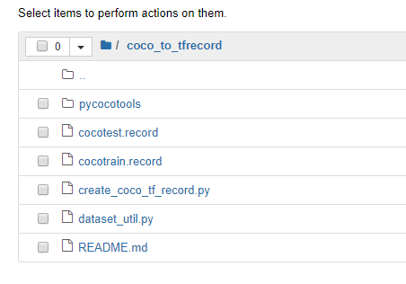
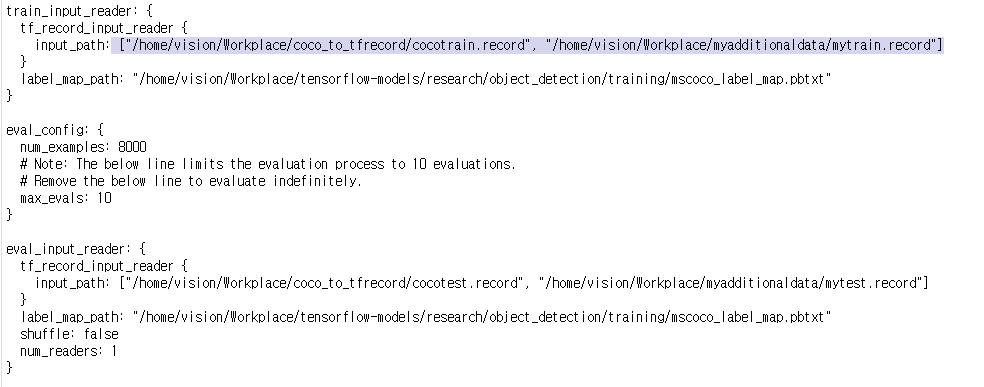
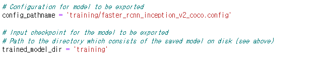

# How to retrain the model zoo using own dataset to enhance specific model. 

This repository is a simple tutorial. it comes from idea that how to enhance model by adding new dataset based on [tensorflow model zoo](https://github.com/tensorflow/models/blob/master/research/object_detection/g3doc/detection_model_zoo.md)

I am going to explain that how to make tfrecord files from official dataset of Coco dataset and how to add your own dataset with your labeled record files. Eventually it could be trained with tensorflow graph. 

## Set up Training environment. 
Basically, I worked to refer up the Tensorflow model posted Github [repository](https://github.com/EdjeElectronics/TensorFlow-Object-Detection-API-Tutorial-Train-Multiple-Objects-Windows-10/blob/master/README.md). So you might have to follow it to set up environment for Tensorflow.
<pre> environment in my case
* Ubuntu 18.04.3 LTS 
* Conda 4.5.11 
* Tensorflow-gpu 1.13.2 
* Nvida GeForce GTX 1080Ti
</pre>

## 1. Make TFRecord file using Coco Dataset. 
To make tfrecord files with Coco Dataset, follow below step it's refered [this](https://github.com/offbye/tensorflow_object_detection_create_coco_tfrecord). 
 

if you want other versions, you need to modify such script file.

### tensorflow_object_detection_create_coco_tfrecord
### Attention
1) For easy use of this script, Your coco dataset directory struture should like this :
```
    +Your coco dataset root
        +train2014
        +val2014
        +annotations
            -instances_train2014.json
            -instances_val2014.json
```
2) To use this script, you should download python coco tools from [coco website ](http://mscoco.org/dataset/#download) and make it.
After make, copy the pycocotools directory to the directory of this "create_coco_tf_record.py"
or add the pycocotools path to  PYTHONPATH of ~/.bashrc file.
**For convientient , I add pycocotools build in my computer to the project directory, you can use it with python3 directly. But if you use python2, build the python coco tool from [!coco](http://mscoco.org/dataset/#download) **
```
   git clone https://github.com/cocodataset/cocoapi
   cd  cocoapi/PythonAPI/
   make
   pip install Cython
   make
   ls pycocotools/
   cp -rf pycocotools  PATH/tensorflow_object_detection_create_coco_tfrecord/
```

### Example usage:
```
    python create_coco_tf_record.py --data_dir=/path/to/your/coco/root/directory \
        --set=train \
        --output_filepath=/where/you/want/to/save/pascal.record
        --shuffle_imgs=True
```

## 2. Re-train Coco dataset including Own Dataset. 
You can choose which model to train your objection detection classifier on. This tutorial will use the Faster-RCNN-Inception-V2 model. [Download the model here.](http://download.tensorflow.org/models/object_detection/faster_rcnn_inception_v2_coco_2018_01_28.tar.gz) Open the downloaded faster_rcnn_inception_v2_coco_2018_01_28.tar.gz file with a file archiver such as WinZip or 7-Zip and extract the faster_rcnn_inception_v2_coco_2018_01_28 folder. [See specific step](https://github.com/EdjeElectronics/TensorFlow-Object-Detection-API-Tutorial-Train-Multiple-Objects-Windows-10)



Anyway What you have to do for add dataset to existing dataset is that add a list of tfrecord both tfrecord files by coco and your own dataset in the config file like this: 
<pre> 
tf_record_input_reader {
    input_path: [ "path_to_tfrecord_file_1", "path_to_tfrecord_file_2"]
...
}
</pre>
Also eval_input_reader can config same

And then YOU CAN TRAIN DATASET WITH THE BOTH TRRECORD FILES!!
Let you follow training steps typically. 


## 3. Export Non-frozen model for Tensorflow serving. 
On my purpose i should apply this trained model to TFS(tensorflow serving). So i need to export those variables and model.pb 
The way to export follow below step: (This make your trained data Non-frozen model.)

1. Download the files on this page to your working place : 
**exporter_serve.py, exporter_model.py**

2. And modify 
**exporter_model.py**
file corresponding your working path (ex: config file path, training data path.. ) 



3. Run exporter_model.py code. 
```
python exporter_model.py
```

4. Finally you can get exported_model included Non-frozen data with variables and model.pb 

Thanks.

